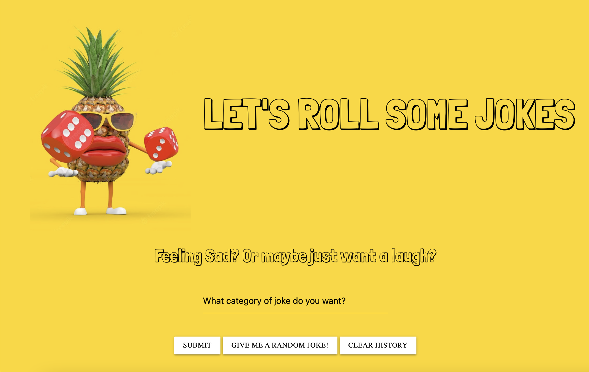

# Random Joke Generator - Group Project

## Desciption

> Feeling sad? Or maybe just want a laugh after a long day?

> Head to our random joke generator to have a little laugh!

## User Story: 
```md
AS someone who loves a good joke
I WANT TO see a joke and a gif
S THAT I can find the best jokes
```

## Screenshot of Webpage 

>

## Installation

> This website doesnt require installation of any programs or software. It can be viewed on any web browser. 

## Built With

> [Visual Studio Code](https://code.visualstudio.com/)

## Acknowledgements

* [GitHub Pages](https://pages.github.com)
* [W3 Schools](https://www.w3schools.com/)
* [MDN Web Docs](https://developer.mozilla.org/en-US/)
* [GIPHY API](https://developers.giphy.com/)
* [Joke API](https://v2.jokeapi.dev/)

## Authors

> * Marissa Tobin - [https://github.com/marissakrantz](https://github.com/marissakrantz)
> * Olivia Orme - [https://github.com/inspirewh](https://github.com/inspirewh)
> * Mahalakshmi Rajendran - [https://github.com/Maharjn](https://github.com/Maharjn)

## Project Status

> Website is NOT currently live. 

## Contact 

> Project Link: []()
